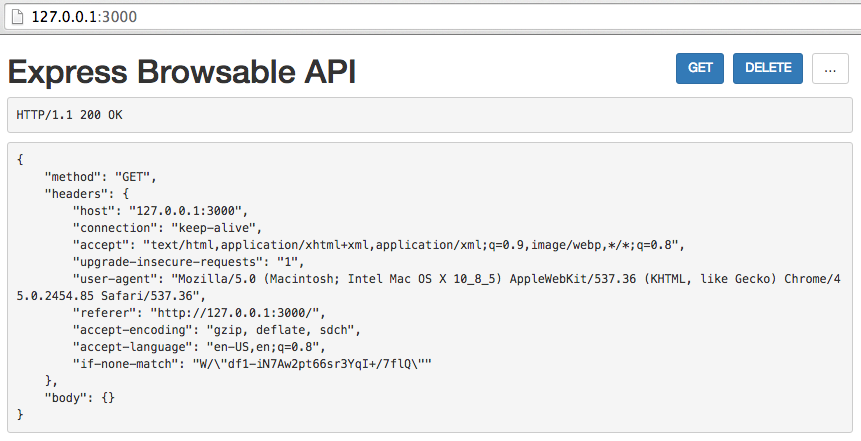
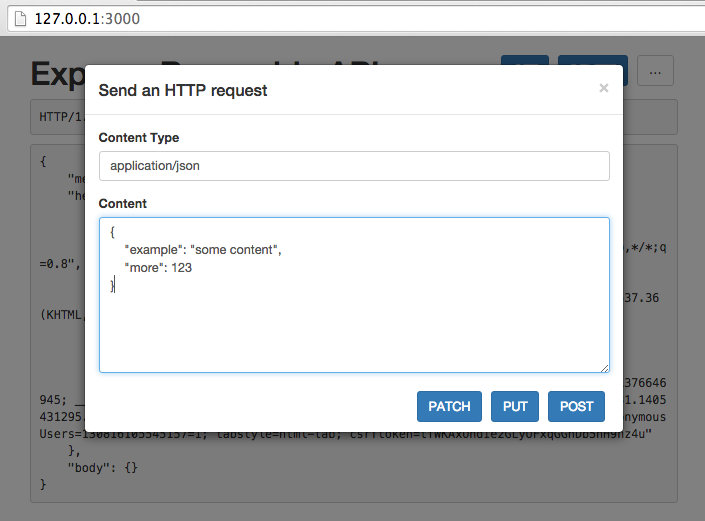

# Express Browsable API

*A demonstration of using content negotiation to render browsable Web APIs in Node/Express.*

* A content negotiation middleware that renders either `text/html` or `application/json` depending on the client `Accept` header.
* A template for rendering the HTML responses.
* The [ajax-form](https://github.com/tomchristie/ajax-form/) library for supporting method and content type overriding on HTML forms.

## Installation

Clone the repository, install the dependancies and start the server:

    git clone git@github.com:tomchristie/express-browsable-api.git
    cd express-browsable-api
    npm install
    node server.js

The service will now be running on `http://127.0.0.1:3000`

## Demonstration

The example server will respond to any route, returning information on the request method, headers, and any JSON content in the request body, if it exists.

Make an HTTP request using `curl`, and the server will return a JSON response:

    $ curl 127.0.0.1:3000
    {
        "method": "GET",
        "headers": {
            "user-agent": "curl/7.28.1",
            "host": "127.0.0.1:3000",
            "accept": "*/*"
        },
        "body": {}
    }

Enter the same URL in the browser, and the server will return HTML, including the rendered JSON content, along with controls for making further requests to the API.

## Usage

If using the Express browsable API in your own project, you need to use the `res.sendData()` method in your routes, rather than the usual `res.send()`.

The content negotiation middleware will then render the data into either JSON or HTML, as appropriate.

For example, use this:

    res.sendData({'hello': 'world'})

And not this:

    req.send(JSON.stringify({'hello': 'world'}))

## Extending the project

Some thoughts on extending the functionality of the project…

* Use API schemas or similar to generate appropriate HTML form inputs for any given endpoint instead of the free-form JSON input.
* Use the the response `Allow` header to determine which methods to display.
* Add support for authentication headers to be set be the client which are persisted across requests.
* Render the application response headers in the HTML content.